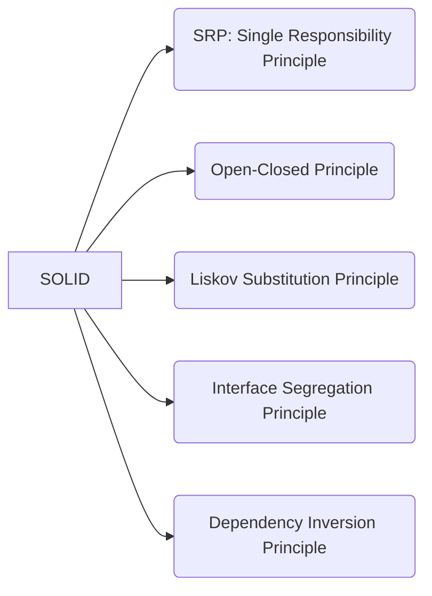

### SOLID

The SOLID Principles of Object-Oriented Programming



The SOLID Principles are five principles of Object-Oriented class design. They are a set of rules and best practices to follow while designing a class structure.

The SOLID principles were first introduced by the famous Computer Scientist Robert J. Martin (a.k.a Uncle Bob) in his paper in 2000.

Uncle Bob is also the author of bestselling books Clean Code and Clean Architecture, and is one of the participants of the "Agile Alliance". Therefore, it is not a surprise that all these concepts of clean coding, object-oriented architecture, and design patterns are somehow connected and complementary to each other. They all serve the same purpose:

> To create understandable, readable, and testable code that many developers can collaboratively work on.

Let's look at each principle one by one. Following the SOLID acronym, they are:

- The `S`ingle Responsibility Principle
- The `O`pen-Closed Principle
- The `L`iskov Substitution Principle
- The `I`nterface Segregation Principle
- The `D`ependency Inversion Principle

#### The Single Responsibility Principle

The Single Responsibility Principle states that a class should do one thing and therefore it should have only a single reason to change.

Benefits:

Following the Single Responsibility Principle is important. First of all, because many different teams can work on the same project and edit the same class for different reasons, this could lead to incompatible modules.

Second, it makes version control easier. For example, say we have a persistence class that handles database operations, and we see a change in that file in the GitHub commits. By following the SRP, we will know that it is related to storage or database-related stuff.

Merge conflicts are another example. They appear when different teams change the same file. But if the SRP is followed, fewer conflicts will appear – files will have a single reason to change, and conflicts that do exist will be easier to resolve.

#### The Open-Closed Principle

The Open-Closed Principle states that software entities, e.g. classes should be designed in a way that they should be open for extension and closed to modification.

Example:
```swift
class Book {
    private var title: String
    private var author: String
    private var ISBN: String
    private var pages: Int
    
    // initializer and other methods
}

/// Later on, you want a new feature allowing you to track the publication date of books. 
/// According to the OCP, you should not modify the existing Book class to do this. 
/// Instead, you should create a new class that extends(i.e., inherits, don't be 
/// confused by the word extension) the Book class and adds the publication date property:

class PublicationBook: Book {
    private var publicationDate: Date
    
    // initializer and other methods
}
```
Benefits:

1. Maintainability. By avoiding changes to existing source code, the OCP helps to minimize the risk of introducing bugs into the system and makes it easier to maintain and update the system over time.
2. Scalability & Flexibility. As the system grows and evolves over time, new functionality can be added by creating new entities that extend the existing ones. This helps to maintain the scalability of the system and avoid the need for significant restructuring of the code base.
3. Testability. By keeping implementation details encapsulated within entities, the OCP makes it easier to test individual entities in isolation, which helps to improve the overall testability of the system.

To summarise, OCP encourages the use of inheritance and polymorphism to extend the functionality of existing code, rather than modifying it directly. 

We should be able to add new functionality without touching the existing code for the class. This is because whenever we modify the existing code, we are taking the risk of creating potential bugs. So we should avoid touching the tested and reliable (mostly) production code if possible.

But how are we going to add new functionality without touching the class, you may ask. It is usually done with the help of interfaces and abstract classes.

#### The Liskov Substitution Principle

The Liskov Substitution Principle states that subclasses should be substitutable for their base classes.

Example:
```swift
class Shape {
    func area() -> Double {
        // ...
    }
}

// Then consider there is a subclass of `Shape` – `Rectangle`

class Rectangle: Shape {
    var length: Double
    vae width: Double
    
    func area() -> Double {
        return length * width
    }
}

// Consider a class that uses `Shape` objects

class ShapesEnjoyer {
    // Any shape can be passed here
    func doSomethingWithShape(shape: Shape) {
        // ...
    }
}

/// By using inheritance and polymorphism, the program can treat Rectangle
/// objects as Shape objects, and call the methods of the Shape class on them.
```

- If a program is written to use a base type, it should still work correctly if a subtype is used instead. This means that any constraints that apply to the base type must also apply to the subtype.
- The subtype must respect the contracts defined by the base type. This includes the method signatures, return types, and exception behavior. If the subtype violates these contracts, the program may break.
- The subtype can add new functionality, but it must not change the behavior of the base type. For example, a subtype can add new methods, but it must not change the return value of the base type's methods.

#### The Interface Segregation Principle

The Interface Segregation Principle states that clients shouldn’t depend on interfaces they do not use.

To achieve this larger interfaces should be split into smaller ones. By doing so, we can ensure that implementing classes only need to be concerned about the methods that are of interest to them.

Example:
```swift
protocol Shape {
    func draw()
}

class Circle: Shape {
    func draw() {
        // ...
    }
}

/// Now suppose we want to add method `resize()` to the `Shape` that can be 
/// used to change the size of a shape.

/// If we add this method to the Shape protocol, all inheritors of Shape will 
/// be forced to implement the `resize()` method, even though it may not be applicable to them.

protocol Shape {
    func draw()
    func resize() // Not all shapes need to be resizable
}

class Circle: Shape { // does not conforms to the protocol `Shape`
    func draw() {
        // ...
    }
}

/// According to the ISP, software components should depend on the minimum set 
/// of interfaces that they need to function.

/// This can be achieved by breaking up protocols into smaller specific ones so 
/// that clients can choose which interfaces to use.

protocol Resizable {
    func resize(width: Int, height: Int)
}

protocol Shape {
    func draw()
}

class Circle: Shape { // ✅
    func draw() {
        // ...
    }
}

class Square: Shape, Resizable { // ✅
    func draw() {
        // ...
    }
    
    func resize(width: Int, height: Int) {
        // ...
    }
}
```

ISP also leads to a reduction in the number of dependencies between components, which can improve the overall performance and scalability of the system.

#### The Dependency Inversion Principle

The fundamental idea that stands behind the principle is clear – high-level modules should not depend on low-level modules and both should depend on abstractions.

The principle of dependency inversion refers to the decoupling of software modules.

The DIP states that software design should depend upon abstractions rather than concrete implementations, to create a flexible and resilient design that is easier to modify and maintain.

In other words, the principle states that high-level modules shouldn’t have a direct knowledge about low-level modules. 

Instead, they should depend on protocols that define the contract of the underlying implementation.

Example:

Suppose we have a `PaymentProcessor` class that depends on a low-level `CreditCardProcessor` class to process payments. 

Here's how we might implement this without following DIP:

```swift
class CreditCardProcessor {
    func processPayment(card: CreditCard) -> Bool {
        // perform credit card processing
        return true
    }
}

class PaymentProcessor {
    private let creditCardProcessor = CreditCardProcessor()
    
    func processPayment(card: CreditCard) -> Bool {
        return creditCardProcessor.processPayment(card: card)
    }
}
```

In this implementation, the high-level `PaymentProcessor` class has a direct dependency on the low-level `CreditCardProcessor` class, which means that we won’t be able to change the payment method when we’ll need it without making changes to `PaymentProcessor`.

To fix it, let’s apply DIP by introducing a protocol that defines the contract of the payment processing and making `CreditCardProcessor` implement this protocol.

```swift
protocol Payable {
    func processPayment(card: CreditCard) -> Bool
}

class CreditCardProcessor: Payable {
    func processPayment(card: CreditCard) -> Bool {
        // perform credit card processing
        return true
    }
}

class PaymentProcessor {
    private let underlyingPaymentProcessor: Payable
    
    init(paymentProcessor: Payable) {
        self.underlyingPaymentProcessor = paymentProcessor
    }
    
    func processPayment(card: CreditCard) -> Bool {
        return underlyingPaymentProcessor.processPayment(card: card)
    }
}
```

This promotes flexibility and decoupling, as we can easily swap out the `CreditCardProcessor` implementation with another implementation that also conforms to the `Payable` contract.

```swift
let creditCardProcessor = CreditCardProcessor()
let paymentProcessor = PaymentProcessor(paymentProcessor: creditCardProcessor)
let success = paymentProcessor.processPayment(card: secondCreditCard)
```
